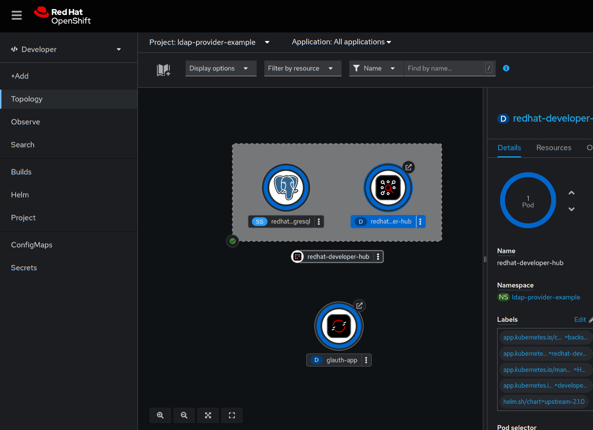
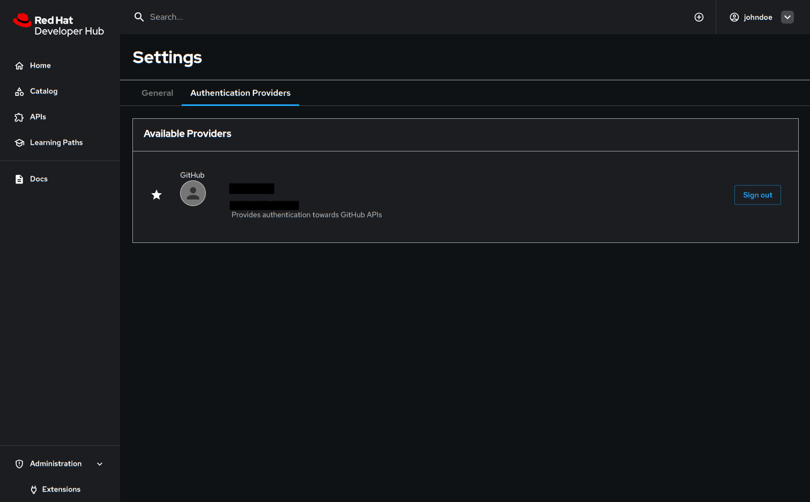

# Using an Authentication Provider from a Dynamic Plugin in Red Hat Developer Hub

## Overview

Out of the box Red Hat Developer Hub contains support for many authentication providers that are built into the Backstage framework as an opinionated setup. However it's possible to disable this authentication provider module and supply a set of frontend and backend dynamic plugins to provide this functionality.  This example repository shows how this can be done by wrapping an existing third-party authentication provider as dynamic plugins.  A simple example ldap setup is provided to make it easy to stand up this example and run it.

## Prerequisites

To build and run the example locally the following will be needed:

- node 20.x
- yarn 3.x (3.8.6 was used to develop this)
- [rhdh-local](https://github.com/redhat-developer/rhdh-local) set up *temporarily* to use [this PR image](https://github.com/redhat-developer/rhdh/pull/2167#issuecomment-2583806269)
- [glauth](https://github.com/glauth/glauth#glauth-ldap-authentication-server-for-developers) as well as [this configuration file](https://gist.github.com/gashcrumb/37379e5d6384d236fd1b3af0dd42a9c6).

## About the example

This example consists of two wrapper projects for some existing LDAP authentication provider plugins:

- [backstage-plugin-ldap-auth-backend](https://github.com/immobiliare/backstage-plugin-ldap-auth/tree/main/packages/ldap-auth-backend) - provides an authentication provider API and bridges authentication to an LDAP server.
- [backstage-plugin-ldap-auth](https://github.com/immobiliare/backstage-plugin-ldap-auth/tree/main/packages/ldap-auth) - Provides a custom SignInPage as well as API client for the backend authentication provider service.

which work in conjunction with the [LDAP catalog provider](https://github.com/backstage/backstage/tree/master/plugins/catalog-backend-module-ldap) backend module which synchronizes an LDAP to users and groups in the Backstage catalog.

The example brings these three modules together as dynamic plugins in Developer Hub using [rhdh-local](https://github.com/redhat-developer/rhdh-local), as Developer Hub already includes the LDAP catalog provider.

### About the wrapper code

The [backend wrapper](plugins/immobiliarelabs-backstage-plugin-ldap-auth-backend/) simply re-exports the original plugin's default module.  It also includes the [example backend configuration](./plugins/immobiliarelabs-backstage-plugin-ldap-auth-backend/app-config.yaml).

The [frontend wrapper](plugins/immobiliarelabs-backstage-plugin-ldap-auth/) also re-exports all of the modules from the original plugin, however it also includes a [custom SignInPage wrapper](./plugins/immobiliarelabs-backstage-plugin-ldap-auth/src/components/SignInPage/SignInPage.tsx).  The `SignInPage` component is the place in a Backstage app where the frontend API reference is connected to the appropriate backend authentication provider API service.  For this example the exported `SignInPage` component simply delegates to the `LDAPSignInPage` component that is provided by the [backstage-plugin-ldap-auth](https://github.com/immobiliare/backstage-plugin-ldap-auth/tree/main/packages/ldap-auth) package.

## Building the Example

After cloning this repo you can build the code using the following sequence of commands:

`yarn install && yarn tsc && yarn build`

Once built the next step is to export the built wrapper packages as dynamic plugins.

### Exporting the wrappers as dynamic plugins

The wrappers can either be exported into a container image or directly to `rhdh-local`'s `local-plugins` directory.  In either case the export command will output an example `rhdh-local` configuration to the terminal.  Copy this output as it will be needed when running the example.

#### Exporting the plugins to a container image

To build a container image run:

```bash
yarn package-dynamic-plugins
```

Use the environment variable `PLUGIN_IMAGE_TAG` to change the image tag as needed.

#### Exporting the plugins to a local directory

To export the plugins to the `./deploy` directory run:

```bash
yarn export-local
```

Use the environment variable `DYNAMIC_PLUGINS_ROOT` to change the output directory to the `local-plugins` directory of `rhdh-local`.

## Running the Example in rhdh-local

Download the example configuration for glauth from [here](https://gist.github.com/gashcrumb/37379e5d6384d236fd1b3af0dd42a9c6) as `sample-simple.cfg` and run `glauth`:

```bash
glauth --ldap 0.0.0.0:3893 -c ./sample-simple.cfg
```

It's startup will look something like this:

```text
Mon, 13 Jan 2025 06:01:37 -0500 INF Debugging enabled
Mon, 13 Jan 2025 06:01:37 -0500 INF AP start
Mon, 13 Jan 2025 06:01:37 -0500 INF Web API enabled
Mon, 13 Jan 2025 06:01:37 -0500 INF Loading backend datastore=config position=0
Mon, 13 Jan 2025 06:01:37 -0500 INF Starting HTTP server address=0.0.0.0:5555
Mon, 13 Jan 2025 06:01:37 -0500 INF LDAP server listening address=0.0.0.0:3893
```

> [!NOTE]
> You may need to run glauth on another host from `rhdh-local` or otherwise muck with your networking configuration

Add the following to the `.env` file of `rhdh-local`

```bash
# update the ldap host to where glauth is running
LDAP_URL=ldap://some-ldap-host:3893
LDAP_BIND_DN=cn=serviceuser,ou=svcaccts,dc=glauth,dc=com
LDAP_BIND_PASSWORD=mysecret
ENABLE_AUTH_PROVIDER_MODULE_OVERRIDE=true
```

Add the following `plugins` configuration to `config/dynamic-plugins.yaml` in `rhdh-local` for the ldap catalog support

```yaml
plugins:
  - package: ./dynamic-plugins/dist/backstage-plugin-catalog-backend-module-ldap-dynamic
    disabled: false
    pluginConfig:
      catalog:
        providers:
          ldapOrg:
            default:
              target: ${LDAP_URL}
              bind:
                dn: ${LDAP_BIND_DN}
                secret: ${LDAP_BIND_PASSWORD}
              users:
                - dn: ou=users,dc=glauth,dc=com
                  options:
                    scope: sub
                    filter: (accountStatus=active)
                    attributes: ['*', '+']
                    paged: false
                  map:
                    rdn: uid
                    name: uid
                    description: description
                    displayName: uid
                    email: mail
                    picture: <nothing, left out>
                    memberOf: memberOf              
              groups:
                - dn: ou=groups,dc=glauth,dc=com
                  options:
                    scope: sub
                    filter: (gidNumber=*)
                    attributes: ['*', '+']
                    paged: false
                  map:
                    description: description
                    displayName: cn
                    email: '<nothing, left out>'
                    memberOf: memberOf
                    members: member
                    name: cn
                    picture: '<nothing, left out>'
                    type: groupType
              schedule:
                frequency: PT10M
                timeout: PT10M
# optional, this is just to suppress any examples                
        import: {}
        rules:
          - allow: [Component, System, Group, Resource, Location, Template, API, User]
        locations: []
  - package: ./local-plugins/immobiliarelabs-backstage-plugin-ldap-auth
    disabled: false
    pluginConfig:
      dynamicPlugins:
        frontend:
          immobiliarelabs-backstage-plugin-ldap-auth:
            components:
              - name: SignInPage
                module: PluginRoot
                importName: SignInPage
```

Add the configuration that was printed out by either `export-local` or `package-dynamic-plugins` to `config/dynamic-plugins.yaml` file in `rhdh-local`, for example when using export-local:

```yaml
  - package: ./local-plugins/immobiliarelabs-backstage-plugin-ldap-auth
    disabled: false
    pluginConfig:
      dynamicPlugins:
        frontend:
          immobiliarelabs-backstage-plugin-ldap-auth:
            signInPage:
              importName: SignInPage
  - package: ./local-plugins/immobiliarelabs-backstage-plugin-ldap-auth-backend-dynamic
    disabled: false
    pluginConfig:
      auth:
        environment: development
        providers:
          ldap:
            development:
              ldapAuthenticationOptions:
                userSearchBase: ou=users,dc=glauth,dc=com
                usernameAttribute: uid
                adminDn: ${LDAP_BIND_DN}
                adminPassword: ${LDAP_BIND_PASSWORD}
                ldapOpts:
                  url:
                    - ${LDAP_URL}
```

Finally start up `rhdh-local`.  Once the dynamic plugins have been installed and the application is started, access the application at [http://localhost:7007](http://localhost:7007), or at the appropriate location where `rhdh-local` is running.

### Navigating the running example

Accessing the Developer Hub instance at [http://localhost:7007](http://localhost:7007) should lead to the LDAP login page


The LDAP example configuration defines a few users, try the following:

```text
LDAP Name: johndoe
Password: dogood
```

After logging in, click on "Settings" in the side-navigation and note that the current user is johndoe and has a user defined in the catalog


## But nothing is listed under Authentication Providers in the settings

There is no `providerSettings` configuration for this example which is normally used to add entries to the "Settings" -> "Authentication Providers" page.  This is because the frontend plugin does not implement or export the necessary API factory to connect the button which initiates sign-in/sign-out.  However it's possible to add additional authentication providers to Developer Hub as well, these authentication providers will be available on this tab.  As an example, a github authentication provider can be added via a dynamic plugin and the following configuration:

```yaml
      - disabled: false
        package: >-
          oci://quay.io/gashcrumb/custom-authentication-module-example:latest!github-auth-provider-wrapper-dynamic
        pluginConfig:
          auth:
            environment: development
            providers:
              github:
                development:
                  clientId: '${GITHUB_CLIENT_ID}'
                  clientSecret: '${GITHUB_CLIENT_SECRET}'
```

## Running the example on OpenShift

To deploy this example to OpenShift, first a glauth server will be configured and started, and then Developer Hub will be deployed using Helm.  Also, a github authentication provider will be added to allow for a more real-world use case, where login is provided by LDAP and source control access is authorized by GitHub.  Deploying this example to a cluster requires that the example has been built and pushed to an image registry that your cluster has access to.  A prebuilt copy of this example is available [here](https://quay.io/repository/gashcrumb/custom-authentication-module-example).

For this simple example everything is deployed to the same namespace, so first off from a terminal with a logged in with `oc` create that:

```bash
oc new-project ldap-provider-example
```

### Deploying glauth

Use the provider `01-deploy-glauth.sh` script to start up glauth:

```bash
./01-deploy-glauth.sh
```

The output should look something like:

```text
configmap/glauth-config created
deployment.apps/glauth-app created
service/glauth-app exposed
```

And the output of the glauth-app deployment's pod should look like:

```text
<nil> map[employeenumber:[12345 54321] employeetype:[Intern Temp]]
Mon, 17 Mar 2025 13:08:15 +0000 INF Debugging enabled
Mon, 17 Mar 2025 13:08:15 +0000 INF AP start
Mon, 17 Mar 2025 13:08:15 +0000 INF Web API enabled
Mon, 17 Mar 2025 13:08:15 +0000 INF Loading backend datastore=config position=0
Mon, 17 Mar 2025 13:08:15 +0000 INF LDAP server listening address=0.0.0.0:3893
Mon, 17 Mar 2025 13:08:15 +0000 INF Starting HTTP server address=0.0.0.0:5555
Mon, 17 Mar 2025 13:08:30 +0000 DBG Tick value=2025-03-17T13:08:30Z
```

### Deploying Developer Hub

#### Create the rhdh-secrets secret

From the OpenShift console Developer perspective, ensure that `ldap-provider-example` is the current namespace, then click on "Secrets" in the main navigation, "Create" at the top-right of the page and select "Key/value secret".  Name the secret `rhdh-secrets` and add the following keys and values:

```text
ENABLE_AUTH_PROVIDER_MODULE_OVERRIDE=true
GITHUB_CLIENT_ID=<paste your client ID or use a dummy value>
GITHUB_CLIENT_SECRET=<paste your client secret or use a dummy value>
LDAP_BIND_DN=cn=serviceuser,ou=svcaccts,dc=glauth,dc=com
LDAP_BIND_PASSWORD=mysecret
LDAP_URL=ldap://glauth-app:3893
```

#### Deploy the Helm Chart

From the OpenShift console Developer perspective, ensure that `ldap-provider-example` is the current namespace, then click on "Helm" in the main navigation, "Create" at the top-right of the page and select "Helm Release".  Type "Developer Hub" in the search input, and select "Red Hat Developer Hub".  Finally, click "Create" on the detail pop-out to get into the Helm deployment page.

Update `global.clusterRouterBase` to match your cluster's DNS domain

Update `global.dynamic.plugins` with the following configuration.  If you've built your own copy of the example and deployed it to a registry server, update the plugin URLs as necessary:

```yaml
      - disabled: false
        package: >-
          ./dynamic-plugins/dist/backstage-plugin-catalog-backend-module-ldap-dynamic
        pluginConfig:
          catalog:
            providers:
              ldapOrg:
                default:
                  bind:
                    dn: '${LDAP_BIND_DN}'
                    secret: '${LDAP_BIND_PASSWORD}'
                  groups:
                    - dn: 'ou=groups,dc=glauth,dc=com'
                      map:
                        description: description
                        displayName: cn
                        email: '<nothing, left out>'
                        memberOf: memberOf
                        members: member
                        name: cn
                        picture: '<nothing, left out>'
                        type: groupType
                      options:
                        attributes:
                          - '*'
                          - +
                        filter: (gidNumber=*)
                        paged: false
                        scope: sub
                  schedule:
                    frequency: PT1M
                    timeout: PT1M
                  target: '${LDAP_URL}'
                  users:
                    - dn: 'ou=users,dc=glauth,dc=com'
                      map:
                        description: description
                        displayName: uid
                        email: mail
                        memberOf: memberOf
                        name: uid
                        picture: '<nothing, left out>'
                        rdn: uid
                      options:
                        attributes:
                          - '*'
                          - +
                        filter: (accountStatus=active)
                        paged: false
                        scope: sub
            rules:
              - allow:
                  - Component
                  - System
                  - Group
                  - Resource
                  - Location
                  - Template
                  - API
                  - User
          permission:
            enabled: false
      - disabled: false
        package: >-
          oci://quay.io/gashcrumb/custom-authentication-module-example:latest!github-auth-provider-wrapper-dynamic
        pluginConfig:
          auth:
            environment: development
            providers:
              github:
                development:
                  clientId: '${GITHUB_CLIENT_ID}'
                  clientSecret: '${GITHUB_CLIENT_SECRET}'
      - disabled: false
        package: >-
          oci://quay.io/gashcrumb/custom-authentication-module-example:latest!immobiliarelabs-backstage-plugin-ldap-auth
        pluginConfig:
          dynamicPlugins:
            frontend:
              immobiliarelabs-backstage-plugin-ldap-auth:
                signInPage:
                  importName: SignInPage
      - disabled: false
        package: >-
          oci://quay.io/gashcrumb/custom-authentication-module-example:latest!immobiliarelabs-backstage-plugin-ldap-auth-backend-dynamic
        pluginConfig:
          auth:
            environment: development
            providers:
              ldap:
                development:
                  ldapAuthenticationOptions:
                    adminDn: '${LDAP_BIND_DN}'
                    adminPassword: '${LDAP_BIND_PASSWORD}'
                    ldapOpts:
                      url:
                        - '${LDAP_URL}'
                    userSearchBase: 'ou=users,dc=glauth,dc=com'
                    usernameAttribute: uid
```

Add `upstream.backstage.ExtraEnvVarsSecrets` to the helm config:

```yaml
    extraEnvVarsSecrets:
      - rhdh-secrets
```

This setup requires at least Developer Hub 1.5, if needed, update `upstream.backstage.image` to use an image that contains this version, for example:

```yaml
    image:
      pullPolicy: Always
      registry: quay.io
      repository: rhdh/rhdh-hub-rhel9
      tag: '1.5'
```

After saving, Developer Hub will be deployed and visible in the OpenShift console Topology View alongside glauth:



Click on the "Open URL" icon hanging off of the redhat-developer-hub deployment to open a tab to Developer Hub.  The steps mentioned previously in ["Navigating the Running Example"](#navigating-the-running-example) are still appropriate.  Additionally if you've configured credentials for GitHub, navigate to the "Settings" section of the app.  It should be possible to log into the GitHub authentication provider, for example:


